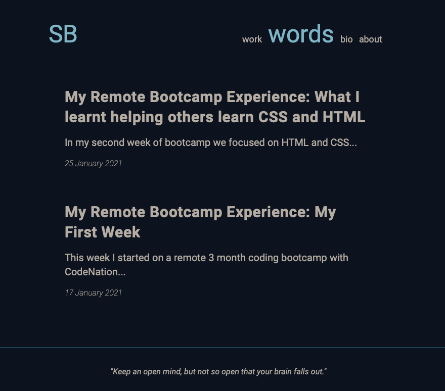
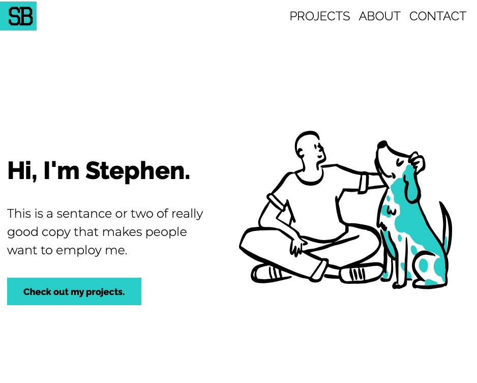

## Hey I'm Steve, a web focused developer. 👋

### About me

- I have a site on the world wide web at [stephenbooth.dev](https://www.stephenbooth.dev). 🌎

- Currently studying remotely at CondeNation, Manchester. 📚
- I mostly use React for my front-end projects, for backend I've used both Node and Python. 🐍
- I am an ex touring musician. I swapped festivals and clubs for problem solving and debugging. 🙌
- I like sentences ending with emojis. 🤷‍♂️
- I dislike a making profile pages. 👎

### Deployed Projects

-[stephenbooth.dev](https://www.stephenbooth.dev)

-[Trump, West or Swift?](https://boothscript.github.io/west-trump-swift)

-[Portfolio Mockup](https://boothscript.github.io/portfolio2)

### In The Works

- PROJECT DASHROO
  - A personal modular productivity dashboard and Journal

- Rooter
  - Automatic routing CMS for charity collection tins.
